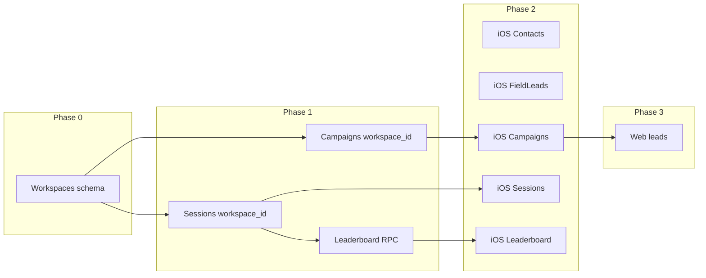

# Migrate FLYR to workspace-scoped data

## Current state

- **Workspace** is used only for: auth/routing ([WorkspaceContext](FLYR/Core/WorkspaceContext.swift)), invite flow, and UI (leaderboard label, paywall copy). It is **not** used for data access.
- **Data** is keyed by `user_id` / `owner_id`: campaigns, sessions, contacts, field_leads, integrations, billing. The DB already has `workspace_id` and workspace RLS on **contacts** (and field_leads in a view) via [20250218000000_phase_1_1b_consolidate_leads_into_contacts.sql](supabase/migrations/20250218000000_phase_1_1b_consolidate_leads_into_contacts.sql), but that migration references `public.workspaces(id)`, `primary_workspace_id(uuid)`, and `is_workspace_member(uuid)` which are **not** defined in this repo. They likely exist in production or another codebase.

---

## Phase 0: Ensure workspace schema exists (Supabase)

If `workspaces` and helpers are not in this repo, add a migration that:

- Creates `public.workspaces` (e.g. `id`, `name`, `created_at`, `owner_id` or similar).
- Creates `public.workspace_members` (e.g. `workspace_id`, `user_id`, `role`) and unique index on `(workspace_id, user_id)`.
- Adds `public.primary_workspace_id(p_user_id uuid)` returning the user’s “primary” workspace (e.g. first membership or owned workspace).
- Adds `public.is_workspace_member(p_workspace_id uuid)` returning true if `auth.uid()` is in that workspace (via `workspace_members`).

**Decision:** Confirm whether these objects already exist in your deployed DB. If yes, skip this phase or add an idempotent migration that only creates them if missing.

---

## Phase 1: Database – add workspace_id and RLS

**1.1 Campaigns**

- New migration: `ALTER TABLE public.campaigns ADD COLUMN IF NOT EXISTS workspace_id uuid REFERENCES public.workspaces(id);` plus index on `workspace_id`.
- Backfill: set `campaigns.workspace_id = primary_workspace_id(owner_id)` where `workspace_id IS NULL`.
- RLS: add policy so workspace members can SELECT/INSERT/UPDATE/DELETE campaigns where `workspace_id = X` and `is_workspace_member(X)`. Keep existing owner-based policies during transition, or replace with “owner or workspace member” so both scopes work.

**1.2 Sessions**

- Add `workspace_id uuid REFERENCES public.workspaces(id)` to `public.sessions`, index, and backfill from `primary_workspace_id(user_id)`.
- RLS: allow access if `sessions.user_id = auth.uid()` (own) **or** `is_workspace_member(sessions.workspace_id)` (team). This supports “my sessions” and “team leaderboard.”

**1.3 Contacts and field_leads**

- Already have (or get from migration) `workspace_id` and RLS in [20250218000000](supabase/migrations/20250218000000_phase_1_1b_consolidate_leads_into_contacts.sql). Ensure RLS allows workspace members; no schema change needed if already done.
- If the app still reads/writes `field_leads` directly, ensure that table has `workspace_id` and same RLS pattern (or use the contacts view that exposes workspace_id).

**1.4 Integrations (optional for v1)**

- `crm_connections` and `user_integrations` are per-user. Options: (A) leave as user-scoped (integrations stay “my API keys”), or (B) add `workspace_id` and allow workspace-level connections later. Recommend (A) for initial rollout.

**1.5 Leaderboard RPC**

- In [20250207000000_fix_leaderboard_and_stats.sql](supabase/migrations/20250207000000_fix_leaderboard_and_stats.sql), `get_leaderboard(p_metric, p_timeframe)` currently aggregates all users with sessions. Add an optional third parameter `p_workspace_id uuid DEFAULT NULL`. When `p_workspace_id` is not null, restrict to users who are members of that workspace (join `auth.users` with `workspace_members` on `workspace_id = p_workspace_id`) and filter `sessions` by that same workspace (using `sessions.workspace_id` once it exists). When null, keep current global behavior for backward compatibility.

---

## Phase 2: iOS app – use workspace for data

**2.1 Single source of workspace**

- All workspace-scoped calls should use `WorkspaceContext.shared.workspaceId`. Guard: if `workspaceId == nil`, show an error or redirect (e.g. back to access/onboarding) instead of calling APIs that require workspace.

**2.2 Contacts**

- [ContactsService](FLYR/Features/Contacts/Services/ContactsService.swift):  
  - `fetchContacts`: add parameter `workspaceId: UUID?`; when non-nil, add `.eq("workspace_id", value: workspaceId)`. Callers pass `WorkspaceContext.shared.workspaceId`. Keep `user_id` filter only if you want to further restrict to “my” contacts within workspace, or drop it and rely on RLS.  
  - `addContact`: set `workspace_id` in insert payload from `WorkspaceContext.shared.workspaceId` (and keep `user_id` as creator if desired).

**2.3 Field leads**

- [FieldLeadsService](FLYR/Features/Leads/Services/FieldLeadsService.swift):  
  - `fetchLeads`: add `workspaceId: UUID?`; when non-nil, `.eq("workspace_id", value: workspaceId)`.  
  - `addLead` / insert: set `workspace_id` from context.

**2.4 Campaigns**

- [CampaignsAPI](FLYR/Feautures/Campaigns/CampaignsAPI.swift):  
  - `fetchCampaigns()`: switch to workspace-scoped: when `WorkspaceContext.shared.workspaceId` is non-nil, use `.eq("workspace_id", value: workspaceId)` instead of (or in addition to) `owner_id`.  
  - `fetchCampaignsForUser(userId:)`: either deprecate or make it “campaigns for current workspace” (same as above).  
  - `createV2`: set `workspace_id` in the insert payload from `WorkspaceContext.shared.workspaceId`; keep `owner_id` as current user.
- [CampaignsHooks](FLYR/Feautures/Campaigns/CampaignsHooks.swift) / [CampaignsView](FLYR/Feautures/Home/CampaignsView.swift): load campaigns for current workspace (no longer pass `userId` for listing).

**2.5 Sessions**

- [SessionManager](FLYR/Features/Map/SessionManager.swift): when creating/saving a session, set `workspace_id` from `WorkspaceContext.shared.workspaceId` in the insert/update payload.
- [SessionsAPI](FLYR/Features/Map/Services/SessionsAPI.swift): `fetchUserSessions` / `fetchSessionsForCampaign` can stay user-scoped for “my sessions” lists, or add workspace-scoped variants that filter by `workspace_id` if you want “team sessions” elsewhere.

**2.6 Leaderboard**

- [LeaderboardService](FLYR/Features/Stats/Services/LeaderboardService.swift): when “My team” is selected, pass `WorkspaceContext.shared.workspaceId` into the RPC (e.g. new param `p_workspace_id`). Backend/DB must support it (Phase 1.5).

**2.7 Other call sites**

- Replace data-fetch usage of `AuthManager.shared.user?.id` with workspace-scoped calls where the resource is workspace-wide: e.g. [NewCampaignDetailView](FLYR/Feautures/Campaigns/Views/NewCampaignDetailView.swift) (leads/sessions for campaign – campaign is workspace-scoped, so listing can be by workspace or by campaign), [CampaignMapView](FLYR/Features/Map/Views/CampaignMapView.swift) (add contact with workspace_id), [ActivityView](FLYR/Feautures/Home/Views/ActivityView.swift) (sessions – can stay user or become workspace). Use a clear rule: “if it’s shared with the team, scope by workspace; if it’s strictly personal, keep user.”

---

## Phase 3: Web app – align with workspace

- **Leads/contacts:** [web/src/lib/fieldLeads.ts](web/src/lib/fieldLeads.ts) and [web/src/hooks/useLeads.ts](web/src/hooks/useLeads.ts) currently filter by `user_id`. Add workspace context (from your web auth/API) and: (1) filter by `workspace_id` when loading leads/contacts, (2) set `workspace_id` on create/update.
- **Integrations / billing:** Can stay user-scoped unless you explicitly want workspace-level integrations.
- **Stats/leaderboard:** If web has a leaderboard or stats, pass workspace ID to the same RPC as iOS when showing “team” scope.

---

## Phase 4: Backend API routes (this repo)

- [backend-api-routes](backend-api-routes): any route that filters by `user.id` for workspace-owned resources (e.g. campaign addresses, buildings) should instead (or also) allow by workspace. For example, resolve workspace from the authenticated user (e.g. primary workspace or from header) and filter by `workspace_id` for campaigns and related tables. Billing and integrations can remain user-scoped unless you decide otherwise.

---

## Order of operations

1. **Phase 0** (if needed): Add workspace tables and helpers.
2. **Phase 1**: Migrations for campaigns, sessions, leaderboard; RLS and backfills.
3. **Phase 2**: iOS – Contacts, FieldLeads, Campaigns, Sessions, Leaderboard and all call sites using `WorkspaceContext.shared.workspaceId`.
4. **Phase 3**: Web – leads/contacts (and any other workspace-scoped data) use workspace.
5. **Phase 4**: Backend routes in this repo updated to scope by workspace where appropriate.

---

## Risks and notes

- **Existing data:** Backfill must run for `campaigns` and `sessions` so every row has `workspace_id` where possible. Users with no workspace membership need a defined behavior (e.g. `primary_workspace_id` creates a personal workspace, or they are blocked until they have a workspace).
- **WorkspaceContext on iOS:** If the user is not in a workspace (e.g. `workspaceId == nil`), block or redirect instead of making workspace-scoped requests.
- **Integrations/CRM:** Remaining user-scoped is the least disruptive; workspace-level integrations can be a later phase.
