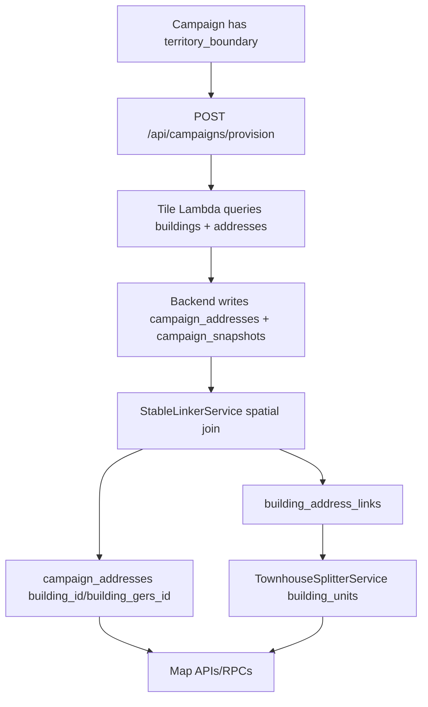
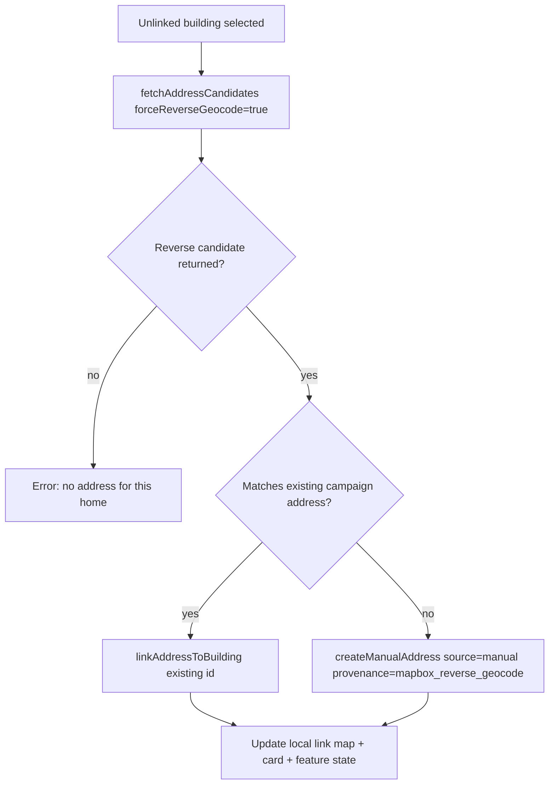

# Home Linking Tech Sheet

Last updated: 2026-05-25

This is the current technical guide for how FLYR links homes, addresses, and building geometry on iOS and in the backend. It covers the normal provisioning linker, manual repair flows, reverse-geocode creation, offline replay, render state, and the places most likely to break.

## One-Line Model

A "linked home" is a campaign address whose current building assignment can be resolved by one or both of:

- `campaign_addresses.building_id` / `campaign_addresses.building_gers_id`
- `building_address_links(campaign_id, address_id, building_id)`

The rendered map then turns that assignment into a building/address feature state so taps, visit logging, cards, and colors target the right `campaign_addresses.id`.

## Core Tables

| Table | Purpose | Notes |
| --- | --- | --- |
| `campaign_addresses` | Source of truth for homes/units in a campaign | Carries address fields, point geometry, visit/contact state, `building_id`, `building_gers_id`, `match_source`, `confidence`, `source`. |
| `buildings` | Campaign-scoped row-backed building polygons | Used by Silver/manual/fallback buildings. `id` is the stable row UUID. `gers_id` is the public external id when present. |
| `building_address_links` | Row-backed address-to-building assignment table | Unique by `(campaign_id, address_id)`. One address can have one current building; one building can have many addresses. |
| `ref_buildings_gold` | Global Gold building polygons | Gold campaigns often link directly through `campaign_addresses.building_id` / `building_gers_id`, not `building_address_links`. |
| `campaign_polished_building_features` | Cached renderable building FeatureCollection | Used by address candidate lookup when a building is in polished/snapshot cache rather than `buildings`. |
| `campaign_snapshots` | S3 snapshot metadata for provisioned map geometry | `/api/campaigns/[campaignId]/buildings` reads this. |
| `address_orphans` | Review/assignment state for unlinked addresses | Updated when manual assignment/unassignment happens. |
| `building_stats` | Per-building aggregate visit/scan status | Feeds map colors and realtime/polling overlays. |
| `cached_*` SQLite tables | iOS offline campaign cache | Local optimistic writes land here before remote sync succeeds. |
| `outbox_entries` SQLite table | iOS offline/failed mutation queue | Replays link, unlink, create, move, delete operations. |

## Identifier Rules

Home linking is mostly identifier hygiene.

| Name | Example | Meaning |
| --- | --- | --- |
| `campaign_addresses.id` | UUID | The home/unit id. Visit logging should ultimately target this. |
| `buildings.id` | UUID | Row-backed campaign building id. Required for `building_address_links.building_id`. |
| `buildings.gers_id` | `overture:building:...`, UUID, provider id | Public building id used by features/cards when available. |
| `ref_buildings_gold.id` | UUID | Gold building id. Usually stored directly on `campaign_addresses.building_id` or `building_gers_id`. |
| Diamond/Bedrock id | `diamond:...`, `bedrock_uk:...` | Snapshot/external building id. May not have a `buildings` row. |
| Manual fallback id | `manual-fallback:<addressId>` or local generated id | Synthetic building created when an address has no footprint. |

Important current behavior:

- Row-backed buildings use `building_address_links`.
- Gold and external snapshot buildings may only update `campaign_addresses.building_id` / `building_gers_id`.
- iOS normalizes building candidates with `building_id`, `gers_id`, and feature `id`.
- Overture ids with colons must be percent-encoded in paths. iOS uses `encodedPathComponent()` for this.
- `BuildingLinkService` retries a failed colon id link with the embedded UUID when possible.

## Concurrency Contract

Row-backed links have a database-level current-assignment constraint:

- Migration: `supabase/migrations/20260504120000_enforce_one_building_link_per_campaign_address.sql`
- Unique index: `idx_building_address_links_campaign_address_unique`
- Key: `(campaign_id, address_id)`

That means one campaign address can only have one current row-backed building link. A building can still have many addresses.

Conflict behavior:

- `StableLinkerService.assignAddressToBuilding` uses `upsert(..., { onConflict: 'campaign_id,address_id' })`.
- `assign_address_to_building_manual(...)` uses `INSERT ... ON CONFLICT (campaign_id, address_id) DO UPDATE`.
- If two users link the same address to different row-backed buildings at nearly the same time, last committed write wins for the `building_address_links` row.
- The previous building's unit counts are recomputed by the service/RPC after reassignment.

What the DB does not enforce:

- Direct/external links stored only in `campaign_addresses.building_id` / `building_gers_id` do not have the same link-table uniqueness shape. They are one row per address, so the address still has one direct building assignment, but there is no separate link history or row-backed building membership record.
- There is no multi-writer conflict prompt in iOS. The loser of a race learns only after refresh/reload.

## Provision-Time Linking

Provisioning is the automatic path.



Backend entry points:

- `backend-api-routes/app/api/campaigns/provision/route.ts`
- `backend-api-routes/lib/services/StableLinkerService.ts`
- `backend-api-routes/lib/services/TownhouseSplitterService.ts`

Provision writes:

- `campaign_addresses`
- `campaign_snapshots`
- `building_address_links`
- `building_units`
- campaign readiness/status fields

## Runtime Fetch And Render

iOS loads map data through `MapFeaturesService` and `BuildingLinkService`.

Primary files:

- `FLYR/Services/MapFeaturesService.swift`
- `FLYR/Features/Buildings/Services/BuildingLinkService.swift`
- `FLYR/Features/Map/Views/CampaignMapView.swift`
- `FLYR/Services/MapLayerManager.swift`

Main building fetch:

1. iOS calls `BuildingLinkService.fetchBuildings(campaignId:)`.
2. Backend endpoint is `GET /api/campaigns/[campaignId]/buildings`.
3. iOS caches the FeatureCollection locally via `CampaignRepository.upsertBuildings`.
4. `MapFeaturesService.filteredRenderableBuildingFeatures` removes non-polygons and non-linkable tiny/shed-like buildings.
5. `MapLayerManager` renders polygons as extrusions and addresses as point/cylinder features.

Map feature link state comes from:

- feature properties: `address_id`, `address_ids`, `address_count`, `is_linked`
- local `buildingAddressMap`
- persisted `building_address_links`
- address direct fields: `building_id`, `building_gers_id`

## Manual Link Existing Address To Building

User path:

1. User taps a building/address and opens the address picker.
2. iOS builds `BuildingAddressPickerContext`.
3. `BuildingAddressPickerSheet` loads candidates from `/address-candidates`.
4. User selects a candidate, or exact candidate auto-links.
5. iOS calls `BuildingLinkService.linkAddressToBuilding`.

iOS flow:

```swift
BuildingLinkService.shared.linkAddressToBuilding(
    campaignId: campaignId,
    buildingId: context.id,
    addressId: candidate.id,
    coordinate: candidate.coordinate.clCoordinate
)
```

What happens:

1. Local cache is updated immediately with `CampaignRepository.upsertBuildingAddressLinkLocally`.
2. Outbox entry `link_address_to_building` is queued.
3. If online, the outbox runs the remote call:
   `POST /api/campaigns/[campaignId]/buildings/[buildingId]/addresses`
4. Backend resolves the building:
   `resolveCampaignBuilding(supabase, campaignId, buildingIdParam)`
5. If row-backed, backend calls `StableLinkerService.assignAddressToBuilding`.
6. If external/snapshot, backend calls `StableLinkerService.assignAddressToExternalBuilding`.
7. iOS updates in-memory `buildingAddressMap`, feature state, address point position, overlays, and card state.

Backend route:

- `backend-api-routes/app/api/campaigns/[campaignId]/buildings/[buildingId]/addresses/route.ts`

Database function fast path:

- `supabase/migrations/20260511120000_manual_building_address_link_rpcs.sql`
- `assign_address_to_building_manual(...)`

## Manual Create Address And Link It

User path:

1. User taps "Add manual address" from picker/map tools.
2. iOS opens `ManualAddressCreationSheet`.
3. User searches/confirms address and optional contact.
4. iOS calls `BuildingLinkService.createManualAddress`.

Backend route:

- `POST /api/campaigns/[campaignId]/addresses/manual`

Payload fields:

- `id` / `address_id` optional client UUID for idempotent offline replay
- `longitude`, `latitude`
- `formatted`
- optional `house_number`, `street_name`, `locality`, `region`, `postal_code`, `country`
- optional `building_id`
- optional `address_provenance`
- optional `user_confirmed`

Backend behavior:

- Inserts/upserts a `campaign_addresses` row with `source = 'manual'`.
- If the target is row-backed (`buildings.id` exists), calls `StableLinkerService.assignAddressToBuilding`.
- If the target is snapshot/external, calls `StableLinkerService.assignAddressToExternalBuilding`.
- Reverse-geocode-created rows get lower confidence (`0.65`) than confirmed/manual rows.

Important risk:

- A manual address linked to a snapshot/external building may not create a `building_address_links` row because there is no row-backed `buildings.id`.
- Any code path that only checks `building_address_links` can miss these homes. Code must also check `campaign_addresses.building_id` / `building_gers_id`.
- Manual address creation and existing-address linking now share the same external assignment service, so both should stamp `building_gers_id`, `match_source = 'manual'`, and confidence.

## Reverse Geocode / Unlinked Home Resolution

This is the "tap an unlinked building and make it into a usable home" path.

Primary files:

- `FLYR/Features/Buildings/Services/UnlinkedHomeAddressResolver.swift`
- `FLYR/Features/Map/Views/CampaignMapView.swift`
- `backend-api-routes/app/api/campaigns/[campaignId]/buildings/[buildingId]/address-candidates/route.ts`
- `backend-api-routes/lib/services/ReverseGeocodeService.ts`

Flow:



Matching rules:

- House number must match.
- Normalized street names must match.
- Postal codes are compared when both sides have them.
- Common suffixes like `St.` / `Street` normalize together.

Relevant tests:

- `FLYRTests/UnlinkedHomeAddressResolverTests.swift`
- `backend-api-routes/lib/services/__tests__/AddressCandidateTrustService.test.ts`
- `backend-api-routes/lib/services/__tests__/ReverseGeocodeService.test.ts`

## Address Candidate Search

Endpoint:

- `GET /api/campaigns/[campaignId]/buildings/[buildingId]/address-candidates`

Query:

- `radius_m`, default/clamped around 60m
- `limit`, default 15
- `seed_lat`, `seed_lng`
- `force_reverse_geocode=true`

Backend candidate inputs:

- building geometry from `buildings`
- fallback geometry from `campaign_polished_building_features`
- Gold `ref_buildings_gold`
- all campaign addresses
- existing `building_address_links`

Selection:

- `StableLinkerService.selectOfficialAddressCandidatesForBuilding(...)`
- Candidates already linked elsewhere are filtered/rejected.
- A reverse-geocode candidate is appended when forced or when no trusted candidate exists.

Trust thresholds:

| Distance / condition | Label | Trusted | Requires confirmation |
| --- | --- | --- | --- |
| `<= 25m` | `high` | yes | no |
| `<= 60m` | `medium` | yes | no |
| `<= 120m` and same street | `low` | yes | yes |
| Otherwise | `low` | no | yes |

Candidate score formula:

- `distanceScore * 0.70`
- plus same-street score `* 0.18`
- plus `0.05` if the candidate source is manual
- plus confidence bonus: `0.20` high, `0.12` medium, `0.06` trusted low
- capped at `1.0`

iOS display behavior:

- Exact auto-link can fire when one non-reverse candidate is within `45m`, score is at least `0.40`, and its address text/parts match the selected building title.
- Picker quality labels are display-only: `Good >= 0.70`, `Fair >= 0.45`, else `Weak`; reverse-geocode candidates display as `Estimated`.

iOS fallback:

- If endpoint is unavailable and there is a seed coordinate, iOS searches cached campaign addresses locally.
- If `forceReverseGeocode` is true and the server does not return one, iOS can call Mapbox reverse geocode directly.

## Unlink / Delete Manual Unit

iOS methods:

- `unlinkAddressFromBuilding(...)`
- `deleteManualUnitFromBuilding(...)`

Backend route:

- `DELETE /api/campaigns/[campaignId]/buildings/[buildingId]/addresses?address_id=...`
- `mode=delete_manual` deletes the manual address row as a unit.

Database function:

- `unassign_address_from_building_manual(...)`

Behavior:

- Deletes the `building_address_links` row when there is a row-backed building.
- If deleting a manual unit, verifies `campaign_addresses.source = 'manual'`.
- Otherwise clears `campaign_addresses.building_id`, `building_gers_id`, `match_source`, and `confidence`.
- Updates `address_orphans` back to `pending_review`.
- Recomputes unit counts for remaining linked addresses.

## Manual Building / Fallback Building

Manual buildings are created when the user draws/creates a footprint or when an address needs a fallback renderable building.

Endpoint:

- `POST /api/campaigns/[campaignId]/buildings/manual`

Payload:

- `geometry`: GeoJSON Polygon/MultiPolygon
- `height_m`
- `units_count`
- `levels`
- `address_ids`
- optional `fallback_building_id`
- optional `geometry_source = 'manual_fallback'`

Behavior:

- Inserts a row into `buildings`.
- Creates `building_address_links` rows for supplied `address_ids`.
- Updates `campaign_addresses.building_gers_id`.
- Fallback creation is idempotent by first checking an existing `manual_fallback` link for the first address.

iOS local path:

- `BuildingLinkService.createFallbackBuilding`
- `CampaignRepository.upsertFallbackBuildingLocally`
- outbox operation `fallback_building_created`

## Offline And Outbox

Most home-linking mutations are optimistic.

iOS writes local state first, then queues the remote operation. This means the map can look correct before the backend is actually correct.

Relevant files:

- `FLYR/Offline/Repositories/CampaignRepository.swift`
- `FLYR/Offline/Repositories/OutboxRepository.swift`
- `FLYR/Offline/Services/OfflineSyncCoordinator.swift`
- `FLYR/Offline/OfflineMigrations.swift`
- `FLYR/Features/Buildings/Services/BuildingLinkService.swift`

Outbox operations:

- `link_address_to_building`
- `unlink_address_from_building`
- `create_manual_address`
- `delete_address`
- `delete_manual_address`
- `move_address`
- `move_building`
- `fallback_building_created`
- `delete_building`

Replay handlers live in `OfflineSyncCoordinator.processOutboxEntry`.

Replay ordering:

- `OutboxRepository.fetchPending` orders by `created_at ASC`.
- Entries with the same `dependency_key` are serialized: a newer unsynced entry is blocked while an older unsynced entry with the same dependency key exists.
- `create_manual_address`, `link_address_to_building`, `unlink_address_from_building`, `delete_address`, and address moves use dependency key `address:<campaignId>:<addressId>`, so create-before-link for the same manually created address is protected when both entries exist.
- Independent dependency keys can process in the same batch loop. There is no general cross-entity dependency graph.
- `fallback_building_created` uses `fallback_building:<campaignId>:<addressId>`, so it is not serialized with later plain `address:<campaignId>:<addressId>` mutations unless code explicitly queues them in the right order and the backend tolerates idempotency.
- Failed entries retry up to `maxRetryAttempts = 8`; after that they are dead-lettered. The local optimistic state may remain until a refresh/server reload exposes the failed persistence.

Failure mode to remember:

- If remote replay fails, the user may still see the optimistic local state until a fresh server load overwrites it.
- Debug both local cache and remote tables before assuming a link persisted.

## API Contracts

### Link address to building

`POST /api/campaigns/{campaignId}/buildings/{buildingId}/addresses`

Body:

```json
{
  "address_id": "uuid",
  "longitude": -79.3832,
  "latitude": 43.6532
}
```

Response:

```json
{
  "linked": true,
  "address_id": "uuid",
  "building_id": "public-building-id",
  "linked_address_ids": ["uuid"],
  "unit_count": 1
}
```

### Unlink address from building

`DELETE /api/campaigns/{campaignId}/buildings/{buildingId}/addresses?address_id={addressId}`

Optional:

- `mode=delete_manual`

### Create manual address

`POST /api/campaigns/{campaignId}/addresses/manual`

Body:

```json
{
  "id": "optional-client-generated-uuid",
  "address_id": "optional-client-generated-uuid",
  "longitude": -79.3832,
  "latitude": 43.6532,
  "formatted": "123 Main St",
  "house_number": "123",
  "street_name": "Main St",
  "building_id": "public-building-id",
  "address_provenance": "mapbox_reverse_geocode",
  "user_confirmed": true
}
```

### Address candidates

`GET /api/campaigns/{campaignId}/buildings/{buildingId}/address-candidates?radius_m=60&limit=15&seed_lat=...&seed_lng=...&force_reverse_geocode=true`

Response:

```json
{
  "building_id": "public-building-id",
  "radius_meters": 60,
  "trust_decision": {
    "used_reverse_geocode": true,
    "reason": "client_reverse_geocode"
  },
  "candidates": []
}
```

## Broken-Flow Triage Checklist

Use this order when "home linking is broken."

### 1. Is the app authenticated against the backend?

Symptoms:

- `401 Unauthorized`
- iOS logs show buildings/address endpoints failing
- Link looks local only and disappears after refresh

Check:

- iOS `FLYR_PRO_API_URL`
- Authorization header reaches backend
- `wolfgrid.app` redirect is not stripping auth. `BuildingLinkService` normalizes `https://wolfgrid.app` to `https://wolfgrid.app`.

### 2. Can the backend resolve the building id?

Symptoms:

- `404 Building not found`
- Candidate endpoint empty except reverse geocode
- Existing address link fails

Check:

```sql
-- Row-backed building?
select id, gers_id, source
from buildings
where campaign_id = :campaign_id
  and (id::text = :building_id or gers_id = :building_id);

-- Direct Gold/global building?
select id
from ref_buildings_gold
where id::text = :building_id;
```

Also check whether `:building_id` is a provider id such as `overture:building:<uuid>`, `diamond:*`, or `bedrock_*:*`. Those may be snapshot/external and not row-backed.

### 3. Did the link persist remotely?

For row-backed links:

```sql
select *
from building_address_links
where campaign_id = :campaign_id
  and address_id = :address_id;
```

For direct/external links:

```sql
select id, formatted, building_id, building_gers_id, match_source, confidence, source
from campaign_addresses
where campaign_id = :campaign_id
  and id = :address_id;
```

Expected:

- Row-backed manual link has `building_address_links.match_type = 'manual'`.
- Existing-address external link should have `campaign_addresses.building_gers_id = <public building id>` and `match_source = 'manual'`.
- Manual-created external address currently may only have `building_gers_id` and no `match_source`; treat that as suspicious until fixed.

### 4. Is the iOS map relying on only one link source?

If row-backed links work but Gold/snapshot links do not render, inspect code paths for assumptions that only `building_address_links` matters.

Any reliable resolver should merge:

- `building_address_links`
- `campaign_addresses.building_id`
- `campaign_addresses.building_gers_id`
- feature properties `address_id`, `address_ids`, `address_count`, `is_linked`

### 5. Is local optimistic state hiding a remote failure?

Check iOS outbox/pending sync.

Symptoms:

- Home appears linked immediately.
- It unlinks after refresh/reopen.
- Works offline but not after backend sync.

Look at:

- `OutboxRepository`
- `OfflineSyncCoordinator`
- console logs for `performRemoteLinkAddressToBuilding`, `performRemoteCreateManualAddress`, `performRemoteUnlinkAddressFromBuilding`.

### 6. Is the address candidate route deployed?

Symptoms:

- Picker says nearby search unavailable.
- iOS falls back to manual add/reverse geocode.

Endpoint:

```text
GET /api/campaigns/:campaignId/buildings/:buildingId/address-candidates
```

Common causes:

- Route not deployed.
- Dynamic route param cannot parse encoded building id.
- Building geometry cannot be resolved from `buildings`, polished cache, or Gold.
- Service role env missing.
- Mapbox reverse geocode env missing.

### 7. Are manual SQL RPCs installed?

Check:

```sql
select proname
from pg_proc
where proname in (
  'assign_address_to_building_manual',
  'unassign_address_from_building_manual'
);
```

If missing, backend falls back to non-atomic JS table writes. It can still work, but is less safe and easier to half-fail.

### 8. Did unit counts update?

For multi-unit buildings:

```sql
select building_id, address_id, match_type, is_multi_unit, unit_count, unit_arrangement
from building_address_links
where campaign_id = :campaign_id
  and building_id = :building_row_id
order by address_id;
```

Expected:

- `unit_count` equals number of linked addresses.
- `is_multi_unit` is true when count > 1.
- `unit_arrangement` is `horizontal` for multi-unit, `single` for one.

### 9. Did confidence drop the link below consuming thresholds?

Reverse-geocode manual addresses are written with `confidence = 0.65`. `CampaignMapModeService` treats direct or link-table assignments as acceptable at `confidence >= 0.6`.

Check:

```sql
select id, building_id, building_gers_id, match_source, confidence
from campaign_addresses
where campaign_id = :campaign_id
  and id = :address_id;
```

If confidence is below `0.6`, quality/mode calculations may treat it as not acceptably linked even if an id field exists.

### 10. Was the building filtered out of renderable map features?

iOS filters building features before render:

- Geometry must be `Polygon` or `MultiPolygon`.
- `source = 'manual'` or `source = 'manual_fallback'` always passes.
- Non-linkable `building_type` values are removed: `shed`, `garage`, `garages`, `carport`, `parking`, `parking_garage`, `outbuilding`, `accessory`, `ancillary`.
- If area is known or computable, iOS requires at least `30 sqm`.
- Backend footprint filtering uses similar type exclusions but a stricter default minimum of `40 sqm`.

A valid link can therefore exist while the building footprint is not selectable/rendered.

## Known Risk Areas In Current Code

1. Snapshot/external links do not always create `building_address_links`.
   This is intentional when there is no `buildings.id`, but every card/render resolver must check direct address fields too.

2. Overture/provider ids can change shape between endpoints.
   `overture:building:<uuid>`, raw UUID, feature `id`, `building_id`, and `gers_id` must be normalized together.

3. Manual address creation and manual existing-address link are different persistence paths.
   Existing-address link to a snapshot building uses `assignAddressToExternalBuilding`; manual address creation for a snapshot building sets `building_gers_id` during insert.

4. The map can look correct because of optimistic local cache even when backend persistence failed.
   Always verify remote tables after reproducing.

5. Renderable building RPCs and S3 building endpoint may disagree.
   `/api/campaigns/[campaignId]/buildings` returns geometry from the snapshot path; `rpc_get_campaign_renderable_buildings` and `rpc_get_campaign_full_features` may use Supabase rows/direct fields.

6. Tiny/shed-like buildings are filtered client-side.
   A link can exist but not render as a selectable building if `MapFeaturesService.isRenderableBuildingFeature` filters it out.

7. External manual-create and external existing-link depend on the same service path.
   Both should use `assignAddressToExternalBuilding`; regressions here usually show up as `building_gers_id` present but `match_source` missing.

8. Outbox ordering is per dependency key, not a full transaction graph.
   Same-address create/link ordering is protected by shared address dependency keys, but fallback-building and building-level mutations can interleave with address mutations.

## Source Map

### iOS

- `FLYR/Features/Buildings/Models/BuildingLinkModels.swift`
- `FLYR/Features/Buildings/Services/BuildingLinkService.swift`
- `FLYR/Features/Buildings/Services/UnlinkedHomeAddressResolver.swift`
- `FLYR/Features/Map/Views/CampaignMapView.swift`
- `FLYR/Features/Map/Services/BuildingDataService.swift`
- `FLYR/Services/MapFeaturesService.swift`
- `FLYR/Services/MapLayerManager.swift`
- `FLYR/Offline/Repositories/CampaignRepository.swift`
- `FLYR/Offline/Repositories/OutboxRepository.swift`
- `FLYR/Offline/Services/OfflineSyncCoordinator.swift`

### Backend

- `backend-api-routes/app/api/campaigns/[campaignId]/buildings/[buildingId]/addresses/route.ts`
- `backend-api-routes/app/api/campaigns/[campaignId]/buildings/[buildingId]/address-candidates/route.ts`
- `backend-api-routes/app/api/campaigns/[campaignId]/addresses/manual/route.ts`
- `backend-api-routes/app/api/campaigns/[campaignId]/buildings/manual/route.ts`
- `backend-api-routes/app/api/campaigns/_utils/resolve-campaign-building.ts`
- `backend-api-routes/lib/services/StableLinkerService.ts`
- `backend-api-routes/lib/services/AddressCandidateTrustService.ts`
- `backend-api-routes/lib/services/ReverseGeocodeService.ts`
- `backend-api-routes/lib/services/TownhouseSplitterService.ts`

### Migrations

- `supabase/migrations/20260504120000_enforce_one_building_link_per_campaign_address.sql`
- `supabase/migrations/20260511120000_manual_building_address_link_rpcs.sql`
- `supabase/migrations/20260513200000_add_campaign_map_bundle_rpc.sql`
- `supabase/migrations/20260514170000_fix_renderable_building_links_row_id.sql`
- `supabase/migrations/20260330100000_manual_map_shapes_rpc.sql`

### Tests

- `FLYRTests/UnlinkedHomeAddressResolverTests.swift`
- `FLYRTests/BuildingDataServiceTests.swift`
- `backend-api-routes/lib/services/__tests__/StableLinkerService.test.ts`
- `backend-api-routes/lib/services/__tests__/AddressCandidateTrustService.test.ts`
- `backend-api-routes/lib/services/__tests__/ReverseGeocodeService.test.ts`

## Recommended Fix Strategy

When actively fixing this area, work in this order:

1. Reproduce with one campaign id, one building id, and one address id.
2. Capture exact backend responses for address candidates and link/create calls.
3. Verify remote persistence with the SQL checks above.
4. Compare remote state against iOS local optimistic state after a forced refresh.
5. Fix building id normalization first if the route returns 404.
6. Fix resolver coverage second if persistence succeeds but map/card does not reflect it.
7. Add/extend tests for the exact id shape and persistence path that failed.

Minimum regression coverage:

- Existing campaign address -> row-backed building.
- Existing campaign address -> snapshot/external building.
- Reverse geocode -> exact existing address match.
- Reverse geocode -> new manual address linked to row-backed building.
- Reverse geocode -> new manual address linked to snapshot/external building.
- Offline link queues and replays without duplicating address ids.
- Unlink clears both link-table and direct address fields where appropriate.
