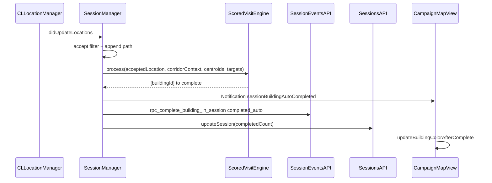
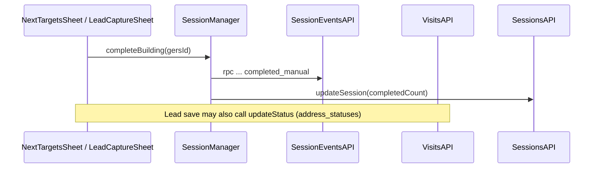
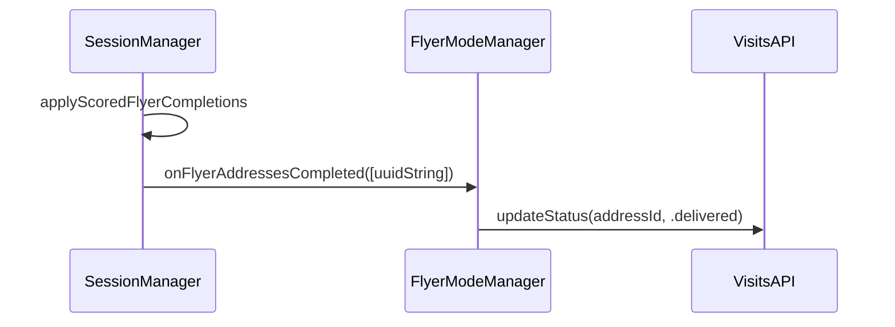

# Visit logging — technical reference

This document describes **how FLYR iOS records “visits”** today: which Supabase tables and RPCs are touched, which Swift entry points fire them, and how door-knocking vs flyer mode differ. It reflects the codebase under `FLYR/` as of the document’s last update.

---

## 1. Mental model: three parallel concepts

The product overloads “visit.” In the database and app there are **three distinct tracks**:

| Track | Purpose | Primary storage (client-side API) |
|-------|---------|-----------------------------------|
| **Session completion** | “User finished this building during this recording session.” | `SessionEventsAPI` → RPC `rpc_complete_building_in_session` |
| **Address CRM status** | Outcome at the door (talked, no answer, delivered, etc.). | `VisitsAPI.updateStatus` → `address_statuses` upsert |
| **Touch / boolean visited** | Lightweight “touched building on map” (legacy / exploration map). | `VisitsAPI.logBuildingTouch` + `VisitsAPI.markAddressVisited` |

They are **not always written together**. For example, GPS auto-complete for door-knocking logs a **session event** and bumps **local map styling**; it does **not** automatically call `VisitsAPI.updateStatus` or `markAddressVisited` from `CampaignMapView`’s auto-complete notification handler.

**Identifiers:**

- **Building session targets** use **GERS / Mapbox-style building ids** (`String`), stored in `SessionManager.targetBuildings` and sent as `p_building_id` to the RPC.
- **Address-level rows** use **`campaign_addresses.id`** (`UUID`) for `address_statuses`, `building_touches`, and `campaign_addresses.visited`.

---

## 2. Session events and session row updates (`SessionEventsAPI`)

**File:** `FLYR/Features/Map/API/SessionEventsAPI.swift`  
**RPC:** `rpc_complete_building_in_session`  
**Parameters:** `p_session_id`, `p_building_id`, `p_event_type`, `p_lat`, `p_lon`, `p_metadata` (JSON object; values wrapped as `AnyCodable`).

### 2.1 Event types

Defined in `FLYR/Features/Map/API/SessionEventType.swift`:

| `SessionEventType` | `rawValue` | Typical use |
|--------------------|------------|-------------|
| `sessionStarted` | `session_started` | Session begins |
| `sessionPaused` | `session_paused` | Pause |
| `sessionResumed` | `session_resumed` | Resume |
| `sessionEnded` | `session_ended` | Session ends |
| `completedManual` | `completed_manual` | User marked building done (sheet, lead flow, etc.) |
| `completedAuto` | `completed_auto` | GPS inference marked building done |
| `completionUndone` | `completion_undone` | User undid completion |

Lifecycle events use the same RPC with **empty** `p_building_id` and lat/lon defaulting to `0` (`logLifecycleEvent`).

### 2.2 Who calls `logEvent` (building-scoped)

| Caller | Event | Notes |
|--------|--------|--------|
| `SessionManager.completeBuilding` | `completed_manual` | After local `completedBuildings` insert; requires `currentLocation` |
| `SessionManager.undoCompletion` | `completion_undone` | |
| `SessionManager.applyScoredVisitCompletions` | `completed_auto` | Metadata: `distance_m`, `scored_engine: true`, `threshold_m` |
| `SessionManager.checkAutoComplete` | `completed_auto` | Legacy dwell; metadata: `distance_m`, `dwell_seconds`, `speed_mps`, `threshold_m` |
| `SessionManager.flushPendingEvents` | any queued | Replays `PendingSessionEvent` when network returns |

On success (or after logging), the app typically calls `SessionsAPI.updateSession(..., completedCount:)` to keep the **`sessions.completed_count`** column aligned with local state.

### 2.3 Offline behavior

If `logEvent` throws, `SessionManager` appends a `PendingSessionEvent` and retries in `flushPendingEvents()` (e.g. app becoming active, after a successful call).

### 2.4 Server-side contract (assumed)

The client treats `rpc_complete_building_in_session` as the **atomic** path for session recording + whatever denormalized updates the backend applies (e.g. rows in `session_events`, updates to `building_stats` — exact behavior lives in Supabase migrations / functions, not duplicated here). See also `docs/GPS_TRACKING_AND_PROXIMITY.md` §8.

---

## 3. Address status / CRM outcomes (`VisitsAPI`)

**File:** `FLYR/Features/Campaigns/API/VisitsAPI.swift`  
**Supabase tables:** `address_statuses` (upsert), `building_touches` (insert), `campaign_addresses` (update)

### 3.1 `updateStatus(addressId:campaignId:status:notes:)`

- Reads optional existing row from `address_statuses` to increment `visit_count`.
- **Upserts** on conflict `address_id,campaign_id` with: `status`, `last_visited_at`, `visit_count`, `notes`.

**`AddressStatus`** enum (`FLYR/Feautures/Campaigns/Models/CampaignDBModels.swift`): `none`, `untouched`, `no_answer`, `delivered`, `talked`, `appointment`, `do_not_knock`, `future_seller`, `hot_lead`.  
Map layer colors use `AddressStatus.mapLayerStatus` → `"hot" | "visited" | "not_visited"`.

**Call sites (non-exhaustive):**

- **Flyer mode** — `FlyerModeManager`: on proximity completion (legacy dwell or scored callback), `updateStatus(..., .delivered)`.
- **Campaign map / lead capture** — `LeadCaptureSheet` `onSave`: maps field lead status → `AddressStatus`, then `updateStatus`; also `sessionManager.completeBuilding(gersId)` for session track.
- **Location card** — `LocationCardView.logVisitStatus` when user picks an outcome.
- **MapController** / **NewCampaignDetailView** — bulk or admin-style updates.

### 3.2 `fetchStatuses(campaignId:)`

Loads `address_statuses` for the campaign into memory for map styling and cards.

### 3.3 `logBuildingTouch` + `markAddressVisited` (legacy map tap)

**File:** `FLYR/Features/Map/Views/FlyrMapView.swift` — on building tap when GeoJSON carries `address_id` and `campaignId`:

1. **Insert** into `building_touches`: `user_id`, `address_id`, `campaign_id`, `touched_at`, optional `building_id`, optional `session_id` (currently often `nil`; TODO in code mentions wiring `SessionManager.sessionId`).
2. **Update** `campaign_addresses`: set `visited = true` for that `address_id`.

These are **fire-and-forget** `Task`s; errors are only logged in DEBUG.

---

## 4. Door-knocking session: how a “visit” is inferred and logged

### 4.1 Session start

`SessionManager.startBuildingSession` (`FLYR/Features/Map/SessionManager.swift`):

1. `SessionsAPI.createSession` — inserts `sessions` with `target_building_ids`, `auto_complete_*` fields, `goal_type` (`knocks` vs `flyers`), etc.
2. Loads **campaign roads** when Pro GPS is enabled → `SessionTrailNormalizer` + `ScoredVisitEngine` (see `loadScoredVisitPipelineForActiveSession`).
3. `SessionEventsAPI.logLifecycleEvent(.sessionStarted, ...)`.

Targets and centroids come from `CampaignMapView.startBuildingSession` → `ResolvedCampaignTarget` list (`MapFeaturesService` / `CampaignTargetResolver`).

### 4.2 GPS pipeline → visit inference

On each **accepted** location update (`CLLocationManagerDelegate`):

1. **Pro mode:** `LocationAcceptanceFilter` (`GPSNormalizationConfig`: max accuracy 20 m, min movement 4 m, max implied walk speed **3.2 m/s**, etc.).
2. **Additional guards:** implied speed &lt; 10 m/s, speed/movement thresholds, segment breaks for large gaps.
3. Append to `pathCoordinates`, update `distanceMeters`, run `trailNormalizer?.process(acceptedLocation:)`.
4. **Door-knocking + non-empty targets:**
   - If `scoredVisitEngine != nil`: `applyScoredVisitCompletions` — `ScoredVisitEngine.process` using **accepted raw location + `CorridorContext`**, **not** the rendered path (see header comment in `ScoredVisitEngine.swift`).
   - Else: `checkAutoComplete` — legacy **dwell** near nearest incomplete centroid.

**Scored engine defaults** (`ScoredVisitConfig.default` in `ScoredVisitEngine.swift`): proximity tiers 15 m / 10 m, `visitThreshold` **2**, wrong-side penalty when corridor side confidence is high, etc.

**Legacy dwell defaults** (`SessionManager`): `autoCompleteThresholdMeters` 15, `autoCompleteDwellSeconds` 8, `autoCompleteMaxSpeedMPS` 2.5, debounce 3 s between auto completions.

**`autoCompleteEnabled` flag:** Stored on the session row. Flyer starts pass `true`; door-knocking passes `false`. Legacy dwell for door-knocking still runs when **`scoredVisitEngine == nil`** (no roads / Pro off) — see `checkAutoComplete` guard in `SessionManager`.

### 4.3 When GPS marks a building complete

1. Insert `buildingId` into `completedBuildings`.
2. Post `Notification.Name.sessionBuildingAutoCompleted` with `buildingId` (GERS string).
3. `SessionEventsAPI.logEvent(..., .completedAuto, metadata: ...)`.
4. `SessionsAPI.updateSession(completedCount:)`.

**`CampaignMapView`** subscribes to `sessionBuildingAutoCompleted` and calls `updateBuildingColorAfterComplete(gersId:)` — **local Mapbox feature-state only**; no automatic `VisitsAPI.updateStatus` in that handler.

### 4.4 Manual completion paths

- **Next targets sheet** — `sessionManager.completeBuilding` → `completed_manual` + map color update.
- **Lead capture** — may `updateStatus` (CRM) **and** `completeBuilding` (session).

### 4.5 Restore after app kill

`restoreActiveSessionIfNeeded` reloads `target_building_ids` but **clears** `buildingCentroids`. Without centroids, neither scored nor legacy GPS completion can match targets. **`rehydrateVisitInferenceFromMapTargets`** (`SessionManager`) plus **`rehydrateSessionVisitInferenceIfNeeded`** (`CampaignMapView` on feature load) repopulates centroids from GeoJSON so GPS logging can resume.

---

## 5. Flyer session: proximity and logging

**Coordinator:** `FlyerModeManager` (`FLYR/Features/Map/FlyerModeManager.swift`)  
**Targets:** `FlyerAddress` list (prefer building-linked addresses; else address-point centroids).

### 5.1 Scored path (same engine as door-knocking)

`SessionManager.setFlyerTargets` registers UUID strings as ids with `CLLocation` centroids. On accepted GPS, `applyScoredFlyerCompletions` runs `ScoredVisitEngine.process` and invokes `onFlyerAddressesCompleted` with completed id strings.

`FlyerModeManager.handleScoredCompletions`:

- Removes address from local list.
- `VisitsAPI.updateStatus(..., .delivered)`.
- Does **not** go through `SessionEventsAPI` with building GERS ids (flyer targets are **address UUIDs** in this path).

### 5.2 Legacy dwell path

When `SessionManager.shared.isUsingScoredVisitForFlyer` is false, `checkProximity` uses adaptive threshold (~10–20 m), max speed 2.5 m/s, dwell **5 s**, then `updateStatus(..., .delivered)` and removes the address.

---

## 6. Realtime map updates (`building_stats`)

**File:** `FLYR/Features/Map/Services/BuildingStatsSubscriber.swift`

Subscribes to Supabase Realtime (and polling fallback) on **`building_stats`** for the campaign. On change, `CampaignMapView` updates Mapbox feature state (`MapLayerManager.updateBuildingState`) so polygon colors reflect server `status` / `scans_total` / QR flags.

This path is **orthogonal** to `session_events`: scans and server triggers may update `building_stats` without the iOS client calling `SessionEventsAPI` for that action.

---

## 7. End-to-end diagrams

### 7.1 Door knock — GPS auto-complete (scored engine)

### 7.2 Door knock — manual complete from sheet

### 7.3 Flyer — scored completion

---

## 8. Source file index

| Concern | Primary files |
|---------|----------------|
| Session RPC + types | `SessionEventsAPI.swift`, `SessionEventType.swift` |
| Sessions table CRUD | `SessionsAPI.swift`, `SessionRecord.swift` |
| Visit / status tables | `VisitsAPI.swift`, `CampaignDBModels.swift` (`AddressStatus`, `AddressStatusRow`) |
| GPS + auto-complete | `SessionManager.swift`, `LocationAcceptanceFilter.swift`, `SessionTrailNormalizer.swift`, `ScoredVisitEngine.swift`, `GPSNormalizationConfig.swift` |
| Flyer UX + status | `FlyerModeManager.swift` |
| Map UI reactions | `CampaignMapView.swift`, `MapLayerManager.swift` |
| Legacy tap logging | `FlyrMapView.swift` |
| Realtime stats | `BuildingStatsSubscriber.swift` |
| Notifications | `Notification+Session.swift` |

---

## 9. Related docs

- `docs/GPS_BREADCRUMBS_AND_SAVE.md` — accepted raw vs normalized path, persistence.
- `docs/GPS_TRACKING_AND_PROXIMITY.md` — session row fields and event types overview.
- `docs/CAMPAIGN_ROADS_TECHNICAL.md` — where road polylines come from (input to `ScoredVisitEngine` / normalizer).

---

## 10. Changelog hints for maintainers

- If you change **`ScoredVisitConfig.default`** or **`GPSNormalizationConfig`** defaults, update §4.2 in this doc and any user-facing fieldwork docs.
- If you wire **`session_id`** into `logBuildingTouch`, update §3.3 and `FlyrMapView` TODO.
- If GPS auto-complete should also set **`address_statuses`**, that would be a **new** explicit call from the `sessionBuildingAutoCompleted` handler (or from the RPC on the server) — it is **not** present today in `CampaignMapView`’s notification handler.
